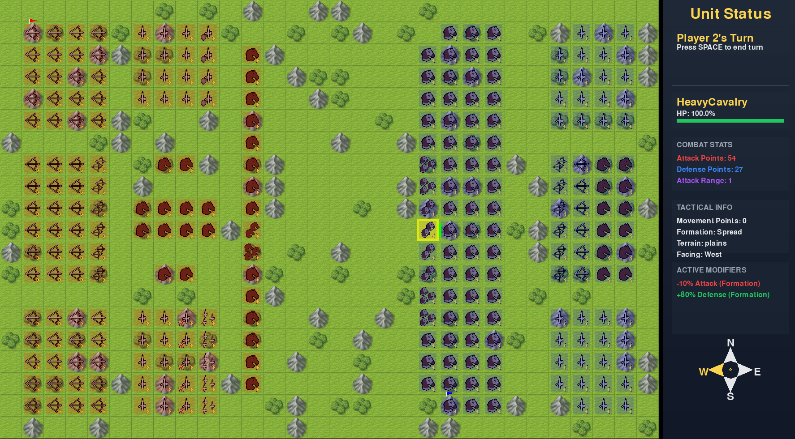

# Warbound 🏹⚔️

## Introduction

Warbound is a turn-based strategy game developed using Python and Pygame, where players move units on a battlefield to defeat their opponents through tactical positioning, army management, and strategic decision-making.

## About the game

In Warbound, players control armies with diverse unit types including infantry, cavalry, and archers. Each player chooses a historical general with unique abilities before the battle begins. The game's core mechanics involve:

- Strategic unit movement
- Tactical formations
- Terrain-based advantages
- Unit-specific combat abilities

## Objective

The primary goal is to defeat the enemy by either:
- Eliminating the enemy general
- Destroying all enemy units

## Features

- Multiple unit types (Hoplite, Archer, Cavalry, Viking, etc.)
- Different tactical formations
- Terrain-based strategy
- Unique general abilities


## Preview


## How to Run


1. Clone the repository:
   ```bash
   git clone https://github.com/arthurabello/trabalho_lp_A1.git
   cd trabalho_lp_A1
   ```

2. Create and activate a virtual environment (recommended):
   ```bash
   python3 -m venv venv
   source venv/bin/activate 
   ```

3. Install the dependencies:
   ```bash
   pip install -r requirements.txt
   ```

4. Run the game::
   ```bash
   cd src
   python3 main.py
   ```

## Running the Tests
The project includes unit tests to ensure the the correctness and reliability of the game's core functionalities. To run them:

1. Navigate to the tests directory:
```bash
cd tests
```

2. Run the tests for each script:
```bash
python3 -m unittest test_graph.py
...
```

## Team Members
This game was developed by students of Applied Mathematics at FGV:
- Arthur Rabello
- Rodrigo Severo